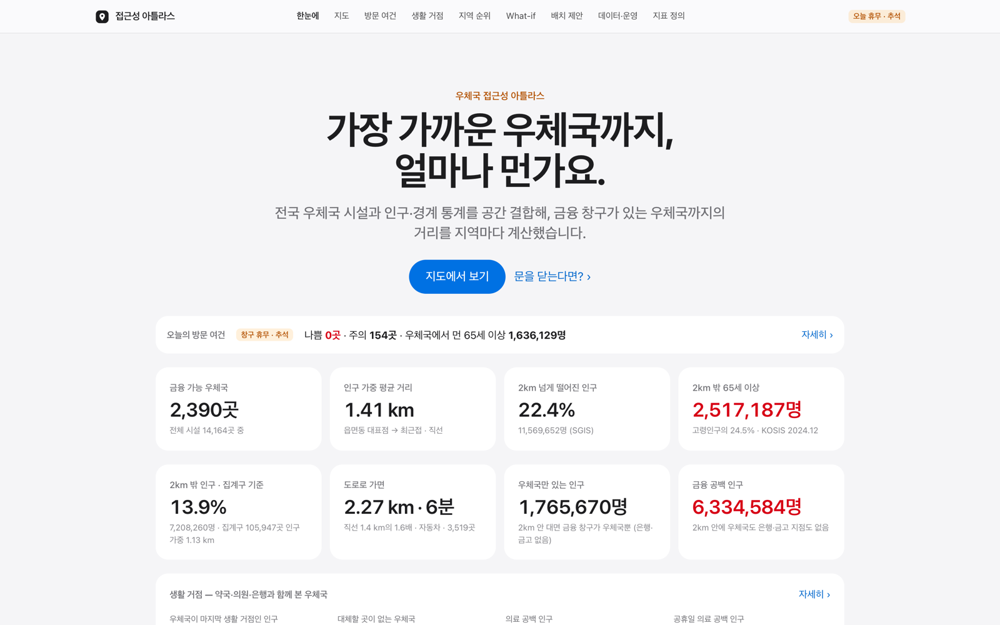
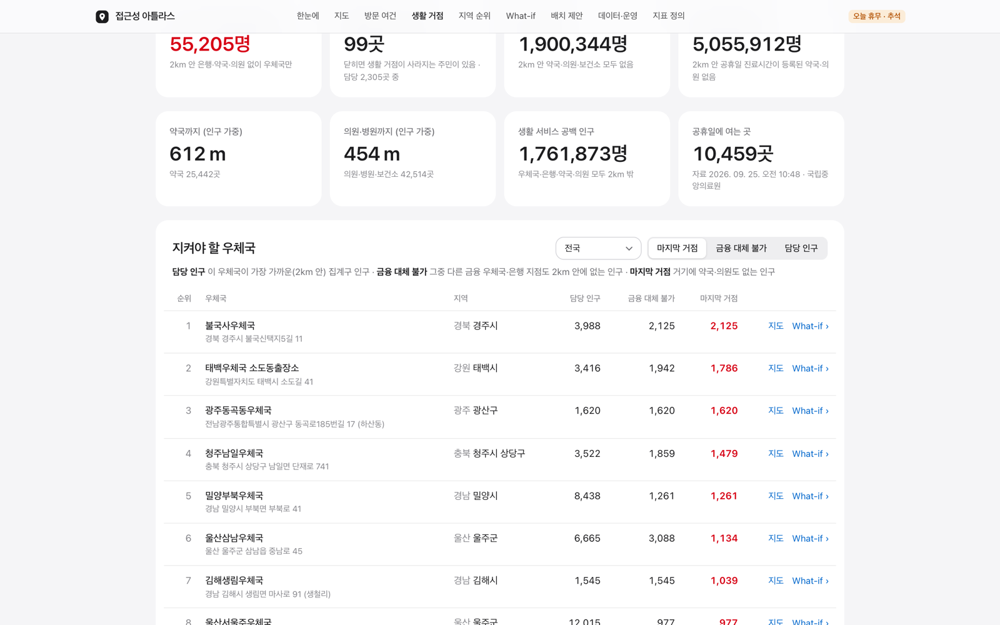
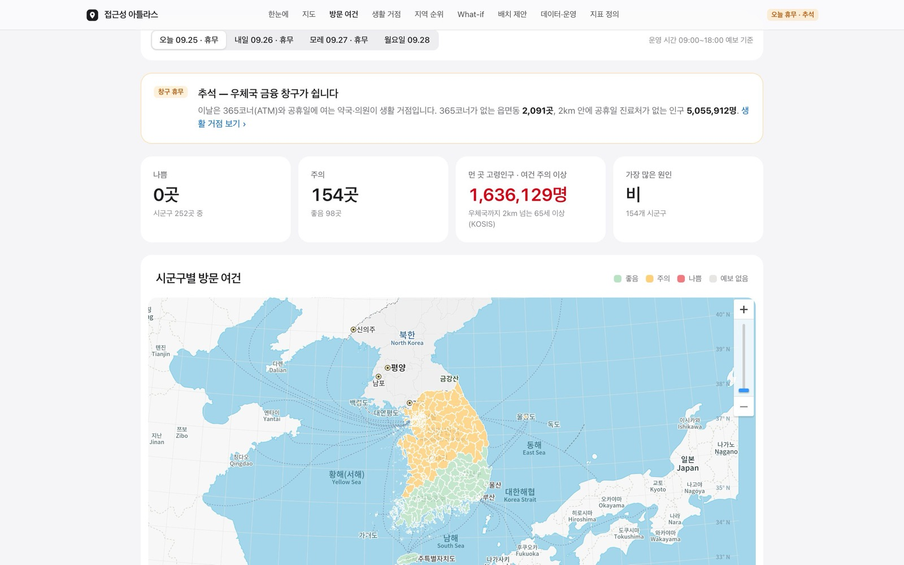
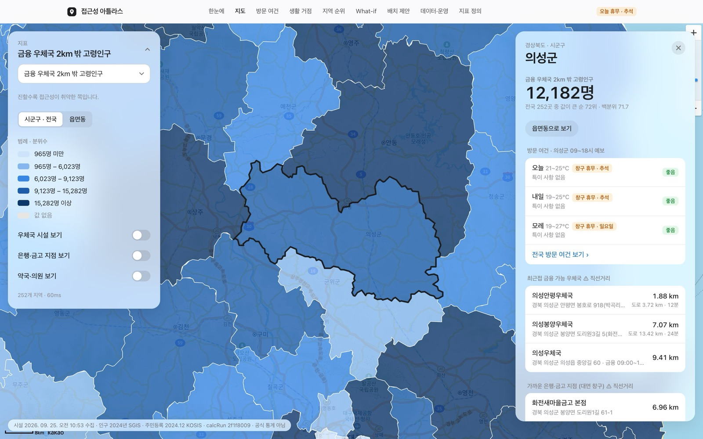
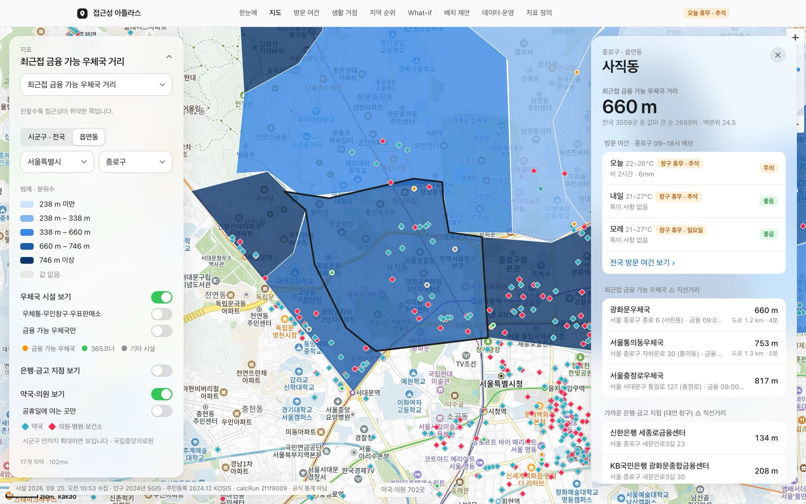
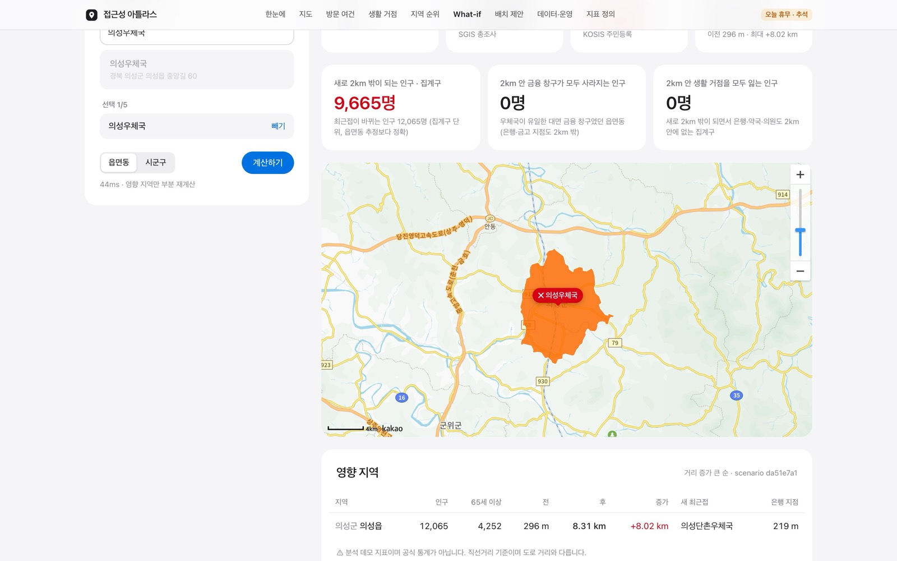
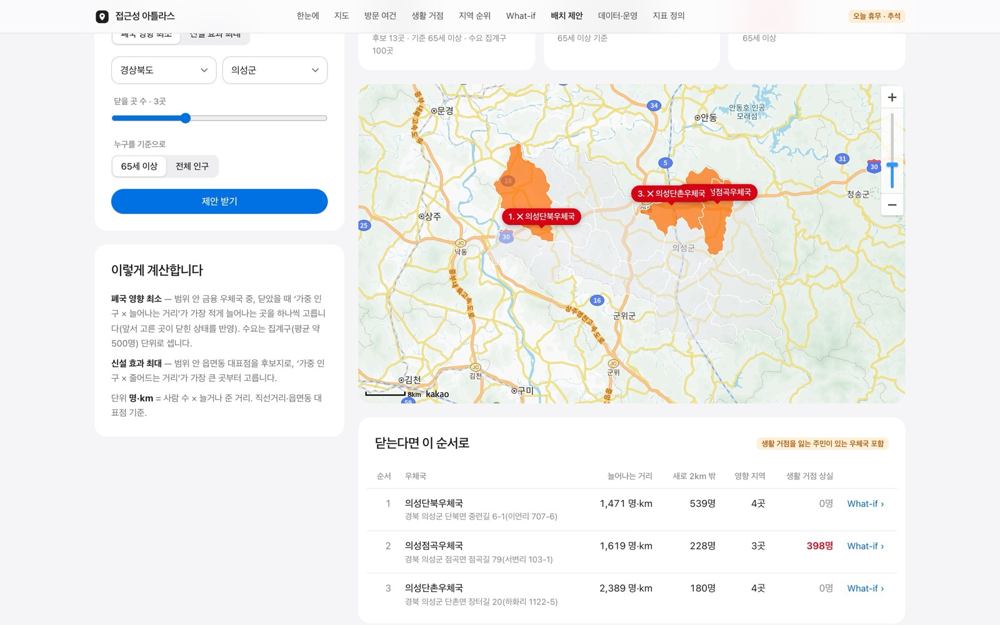
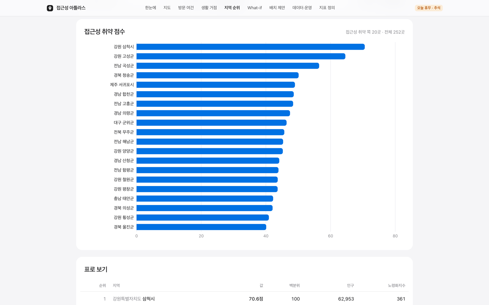
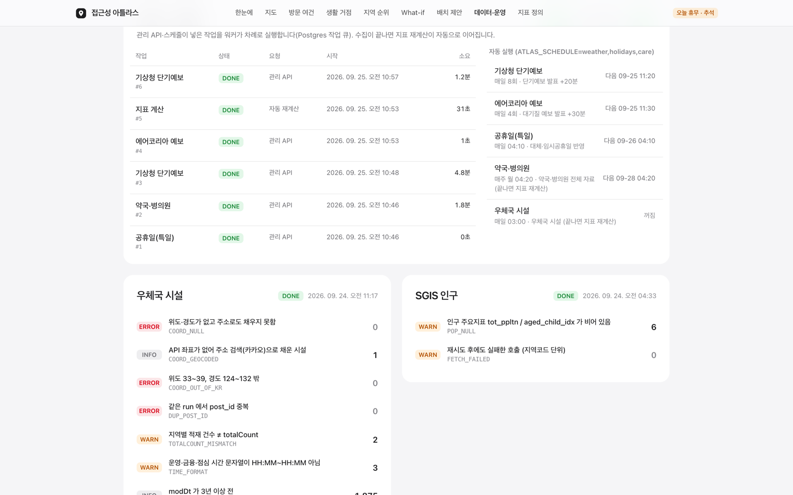

# 우체국 접근성 아틀라스 (Postal Access Atlas)

전국 우체국 시설(우정사업본부 「우체국 찾기」)을 인구·행정구역(SGIS·KOSIS), 은행·약국·병의원, 날씨·대기, 공휴일 자료와
**공간 결합**해 "우체국까지 얼마나 먼가, 우체국이 닫히면 누가 무엇을 잃는가"를 계산하고 보여 주는 로컬 분석 플랫폼입니다.

- **접근성 지표** — 최근접 금융 우체국 거리(직선·도로), 집계구 인구 가중 거리, 2km 밖 인구·고령인구, 금융 공백 인구
- **생활 거점** — 약국·의원·은행과 함께 판정해 **우체국이 동네의 마지막 필수 거점**인 곳과 **닫히면 대신할 곳이 없는 우체국**
- **What-if · 배치 제안** — 폐국 가정 시 멀어지는 사람과 **생활 거점을 모두 잃는 사람**, 닫거나 열 때 영향이 작거나 효과가 큰 곳
- **방문 여건 · 영업일** — 기상청·에어코리아 예보로 오늘~모레 방문이 어려운 지역, 공휴일·연휴엔 창구 휴무와 365코너·휴일 진료 공백
- **데이터·운영** — 작업 큐·스케줄·품질 검사·원본 응답(키 마스킹)을 모두 기록

**엔지니어링**: Postgres 작업 큐(`SKIP LOCKED` + `LISTEN/NOTIFY`) 워커·스케줄러 · 마이그레이션 전용 단계 · 최소 권한 DB 역할 ·
속도 제한·CSP·비루트/읽기 전용 컨테이너 · 측정 기반 최적화(`make bench`, 주요 경로 p50 2.6~16배 개선) · Prometheus 지표 ·
CI(테스트 168개, pip-audit·npm audit·gitleaks·이미지 빌드).

문서: [아키텍처](docs/architecture.md) · [설계 결정·API·데이터 구조](docs/README.md) · [벤치마크](docs/benchmarks.md) · [변경 이력](docs/CHANGELOG.md)

> ⚠ 이 서비스의 지표는 이 프로젝트가 정의한 **분석용 지표이며 공식 통계가 아닙니다.** 거리는 직선거리입니다(도로 거리 지표 제외).



<table>
<tr>
<td width="50%"><br><sub><b>생활 거점</b> · 우체국이 마지막 생활 거점인 인구, 닫히면 대신할 곳이 없는 우체국 순위</sub></td>
<td width="50%"><br><sub><b>방문 여건</b> · 추석 연휴 — 창구 휴무, 365코너 없는 읍면동·공휴일 진료 공백</sub></td>
</tr>
<tr>
<td><br><sub><b>지도</b> · 시군구 단계구분도 + 지역 카드(오늘~모레 방문 여건·휴무 포함)</sub></td>
<td><br><sub><b>지도</b> · 읍면동 + 우체국 시설 · 약국·의원 레이어</sub></td>
</tr>
<tr>
<td><br><sub><b>What-if</b> · 닫힌다면 — 영향 인구·늘어나는 거리·생활 거점 상실</sub></td>
<td><br><sub><b>배치 제안</b> · 영향이 작은 순서 + 생활 거점을 잃는 주민 경고</sub></td>
</tr>
<tr>
<td><br><sub><b>지역 순위</b> · 주제별 지표, 조건은 주소에 저장(공유 가능)</sub></td>
<td><br><sub><b>데이터·운영</b> · 작업 큐·자동 실행 스케줄·스키마·품질 검사</sub></td>
</tr>
</table>

<sub>로컬 실데이터로 찍었습니다(2026-09-25, 추석). 다시 찍기: 서비스를 띄운 상태에서 `pip install playwright && python scripts/capture_screens.py`.</sub>

---

## 1. 처음 실행하기 (맥, Docker Desktop 필요)

```bash
cd ~/Projects/postal-access-atlas
cp .env.example .env        # 키 입력 (make up 이 .env 가 없으면 만들고 ADMIN_TOKEN·API_DB_PASSWORD 를 생성)
make up                     # db·redis → migrate(스키마·역할) → api·worker·web
make smoke                  # 키가 실제로 동작하는지 확인 (응답은 fixtures/ 에 마스킹 저장)
make all-data               # 지역코드 → 우체국 → SGIS → KOSIS → 집계구·은행·도로·좌표검증·약국/병의원·공휴일 → 계산 → 예보 (처음 약 1시간)
open http://localhost:3100/overview
```

이후 예보·공휴일·약국/병의원은 **워커가 자동으로** 갱신합니다(3장). `.env` 에 넣는 값 — 값만 쓰고 **줄 끝 주석은 달지 마세요**:

| 변수 | 발급처 | 필수 | 용도 |
|---|---|---|---|
| `POST_SERVICE_KEY` | 우정사업본부 「우체국 찾기」 OpenAPI 인증키 | 필수 | 전국 우체국·365코너·우체통 |
| `SGIS_CONSUMER_KEY` / `SGIS_CONSUMER_SECRET` | SGIS 개발지원센터 서비스 ID / 보안 Key | 필수 | 인구·행정구역·집계구 |
| `NEXT_PUBLIC_KAKAO_JS_KEY` | Kakao Developers JavaScript 키 (플랫폼 도메인 `http://localhost:3100`) | 필수 | 지도 |
| `KOSIS_API_KEY` | KOSIS 공유서비스 사용자 인증키 | 선택 | 65세 이상 인구·고령인구 지표 |
| `KAKAO_REST_API_KEY` | Kakao REST 키 (같은 앱) | 선택 | 도로 거리·은행 지점·주소 좌표 검증 |
| `DATA_GO_KR_KEY` | 공공데이터포털 **일반 인증키(Decoding)** — 기상청 단기예보·에어코리아 대기오염정보·국립중앙의료원 약국/병의원·한국천문연구원 특일 정보 활용신청 | 선택 | 방문 여건·생활 거점·영업일 |
| `ADMIN_TOKEN` · `API_DB_PASSWORD` | `make up`(make env)이 무작위로 생성 | 자동 | 관리 API 토큰 · API 전용 DB 역할 비밀번호 |
| `ATLAS_SCHEDULE` | 기본 `weather,holidays,care` (`post` 추가 가능, 빈 값이면 자동 실행 끔) | 선택 | 워커 자동 실행 그룹 |

---

## 2. 화면 사용법

모든 화면의 선택 조건(지표·범위·날짜·정렬·페이지)은 주소에 저장되어 새로고침·공유·뒤로 가기에도 같은 화면이 나옵니다.

| 화면 | 주소 | 이렇게 씁니다 |
|---|---|---|
| **한눈에** | `/overview` | 전국 요약 — 금융 우체국 수, 인구 가중 거리, 2km 밖 인구·고령인구, 생활 거점 요약, 거리대별 분포, 취약 시군구. 오늘 방문 여건·휴무 배너 |
| **지도** | `/` | 주제별로 묶인 **지표**를 고르고 **시군구 · 전국 / 읍면동**을 바꿉니다. 지역을 누르면 **지역 카드**(오늘~모레 방문 여건과 휴무, 최근접 우체국 3곳의 직선·도로 거리, 은행 지점, 모든 지표의 전국 순위, 인구). **우체국 시설 · 은행 지점 · 약국·의원(공휴일 진료만 거르기)** 레이어. 시설 점을 누르면 **시설 카드**(지금 영업 중/휴무, 이 우체국이 닫히면 생활 거점을 잃는 인구, 주변 약국·의원·은행) → What-if. `Esc` 로 카드 닫기 |
| **방문 여건** | `/today` | 오늘·내일·모레 09~18시 날씨·미세먼지로 시군구마다 **좋음·주의·나쁨**, 먼 곳에 사는 65세 이상이 많은 순의 "먼저 살펴볼 지역". **공휴일·주말이면 연휴 모드** — 창구 휴무 안내, 365코너 없는 읍면동 수, 공휴일 의료 공백 인구 |
| **생활 거점** | `/hubs` | 우체국이 마지막 생활 거점인 인구·의료 공백·공휴일 의료 공백, **지켜야 할 우체국**(닫히면 금융 창구/모든 생활 거점을 잃는 인구) 순위 — 시도·정렬 필터, 지도·What-if 로 이동 |
| **지역 순위** | `/rankings` | 지표·단위·시도·정렬로 상·하위 20곳 막대와 표. 누르면 지도로 |
| **What-if** | `/whatif` | 우체국 1~5곳 폐국 가정 → 영향 지역·인구·65세 이상·거리 변화, 새로 2km 밖(집계구), 금융 창구 상실, **생활 거점 상실** 인구. `?scenario=` 로 공유 |
| **배치 제안** | `/plan` | 범위·개수·기준으로 **폐국 영향 최소 조합**(생활 거점을 잃는 주민이 있으면 경고) 또는 **신설 효과 최대** 후보지 |
| **데이터·운영** | `/quality` | 작업 큐(요청·스케줄·자동 재계산)·자동 실행 스케줄과 다음 시각·스키마·캐시 상태, 수집·계산별 품질 규칙 건수와 이슈 |
| **지표 정의** | `/about/metrics` | 주제별 지표 계산식·한계, R-FIN-01·VISIT-1·생활 거점·영업일 규칙, 자료 출처 |

API 문서: http://localhost:8100/docs · Prometheus 지표: http://localhost:8100/metrics

---

## 3. 데이터 갱신

### 자동 (워커 스케줄, KST)

| 작업 | 시각 | 비고 |
|---|---|---|
| 기상청 단기예보 | 매일 02:20 · 05:20 · … · 23:20 (8회) | 발표 +20분, 격자 약 240곳 동시 4개 호출 · 약 75초 |
| 에어코리아 대기질 예보 | 매일 05:30 · 11:30 · 17:30 · 23:30 | 호출 4회 |
| 공휴일(특일 정보) | 매일 04:10 | 올해·내년, 대체·임시공휴일 반영 |
| 약국·병의원 | 매주 월 04:20 → **지표 재계산 자동** | 호출 약 110회 · 약 2분 |
| 우체국 시설 | (선택 `post`) 매일 03:00 → 재계산 | 호출 약 390회 |

워커가 꺼져 있던 동안 지난 시각은 몰아서 실행하지 않습니다. 상태는 **데이터·운영** 화면 또는 `make jobs` · `make schedule`.

### 수동 (명령)

| 명령 | 설명 | 실측 |
|---|---|---|
| `make collect` · `make sgis` · `make kosis` | 우체국 시설(SCD2 이력) · SGIS 인구·경계 · KOSIS 주민등록인구 | 3분 · 40초 · 50초 |
| `make oa` · `make banks` · `make road` · `make geocheck` | 집계구 · 은행 지점 · 도로 거리(`MAX=` 호출 예산) · 좌표 검증 | 6분 · 10분 · 25분 · 8분 |
| `make care` · `make holidays` · `make weather` | 약국·병의원 · 공휴일 · 예보(기상청+에어코리아) | 110초 · 1초 · 75초 |
| `make calc` | 지표 계산(새 calc_run) — 공간 조인·최근접·지표·생활 거점·순위·품질 | 30초 |
| `make enqueue KIND=calc` | 워커에 작업 요청 (post·sgis·kosis·oa·banks·road·geocheck·kma·air·care·holidays·calc) | — |
| `make jobs` · `make schedule` · `make status` | 최근 작업 · 스케줄과 다음 시각 · 수집·계산·키 현황 | — |
| `make bench` | API 부하 측정(p50/p95·처리량) + 누적 시간 상위 SQL | 약 1분 |
| `make migrate` | 스키마 마이그레이션 + API 역할 비밀번호 설정 (`make up` 이 자동 실행) | — |
| `make test` | Python 테스트 161개 (단위·계약·PostGIS SQL·What-if 동등성·작업 큐·권한·보안) | 7초 |
| `make prune` | 오래된 원문·스냅샷은 종류별 최근 `KEEP=3` 수집만, 계산 결과는 최근 `KEEP_CALC=5` 만 | — |

관리 API: `POST /api/v1/admin/jobs {"kind": "care"}` (헤더 `X-Admin-Token`) → 202 + `jobId`. 실행은 워커가 합니다.

---

## 4. 지표

| 코드 | 이름 | 정의 |
|---|---|---|
| `NEAREST_FIN_DIST_M` | 최근접 금융 가능 우체국 거리 | 대표점 → 금융 가능 시설 KNN 직선거리 (EPSG:5179) |
| `POPW_FIN_DIST_M` · `FAR2KM_PPLTN` · `FAR2KM_SHARE` | 집계구 인구 가중 거리 · 2km 밖 인구·비율 | 집계구(평균 약 500명) 대표점 → 최근접, 인구 가중 |
| `NEAREST_FIN_ROAD_M` · `NEAREST_FIN_DRIVE_MIN` | 도로 거리 · 차량 시간 ⚠ | 카카오모빌리티 자동차 경로, 직선 상위 2곳 중 짧은 쪽 |
| `FAC_CNT_R{1,2,5}KM` · `HAS_365` · `LUNCH_CLOSED_RATIO` | 반경 안 우체국 수 · 365코너 · 점심 휴무 비율 | `ST_DWithin` 등 |
| `AGED65_PPLTN` · `AGED65_RATIO` · `AGED65_FAR_PPLTN` | 65세 이상 · 비율 · 2km 밖 65세 이상 ⚠ | KOSIS 주민등록인구 |
| `ACCESS_GAP_SCORE` | 접근성 취약 점수 | 100 × (0.6 × minmax(거리) + 0.4 × minmax(노령화지수)) |
| `NEAREST_BANK_DIST_M` · `POST_ONLY_PPLTN` · `FIN_DESERT_PPLTN` | 은행 지점 거리 · 우체국만 있는 인구 · 금융 공백 인구 ⚠ | 카카오 로컬 BK9 대면 지점 |
| `POST_SOLE_HUB_PPLTN` | **우체국이 마지막 생활 거점인 인구** | 집계구: 2km 안 금융 우체국은 있고 은행 지점·약국·의원은 없음 |
| `LIFE_DESERT_PPLTN` · `CARE_DESERT_PPLTN` | 생활 서비스 공백 · 의료 공백 인구 | 2km 안 우체국·은행·약국·의원 모두 없음 / 약국·의원 모두 없음 |
| `HOLIDAY_CARE_GAP_PPLTN` | 공휴일 의료 공백 인구 ⚠ | 2km 안 공휴일 진료시간이 등록된 약국·의원 없음 |
| `POPW_PHARMACY_DIST_M` · `POPW_CLINIC_DIST_M` | 약국 · 의원·병원까지 인구 가중 거리 | 국립중앙의료원 FullData |

**우체국별 대체 불가능성** (`mart.facility_hub`): 이 우체국이 가장 가깝고(2km 안) 두 번째 우체국도 2km 밖인 집계구 중 —
은행 지점도 없으면 *금융 창구를 모두 잃는 인구*, 약국·의원까지 없으면 *생활 거점을 모두 잃는 인구*.

**규칙**: R-FIN-01(금융 가능 = 총괄·소속 우체국 · 금융시간 형식 · `00:00~00:00` 아님 · 집중국 아님),
VISIT-1(09~18시 비·눈·더위·추위·바람·미세먼지 → 좋음/주의/나쁨), 영업일(토·일 + 공공기관 휴일 → 창구 휴무, 3일 이상 연휴).
판정 기준표는 **지표 정의** 화면과 [ADR-011](docs/adr/ADR-011-visit-condition.md)·[ADR-015](docs/adr/ADR-015-life-hub-calendar.md).

---

## 5. 아키텍처

```
브라우저 ─▶ web (Next.js 15, CSP, 비루트) ─ /api/v1 ─▶ api (FastAPI, uvicorn×2, 읽기 전용 FS)
                                                        │  atlas_api 역할: 조회 · What-if 저장 · 작업 INSERT + NOTIFY
                                                        ▼
            migrate(1회, 소유자) ─▶ PostgreSQL 16 + PostGIS ◀── worker (작업 큐 + 스케줄러, 소유자) ─▶ 외부 API
                                    raw · stg · mart · ops        LISTEN · FOR UPDATE SKIP LOCKED
                                         ▲                             │
                                    Redis (캐시 · 속도 제한) ◀─────────┘ 캐시 무효화
```

- 다이어그램과 흐름: [docs/architecture.md](docs/architecture.md). 모든 포트는 `127.0.0.1` 에만 바인딩합니다.
- **작업 큐 (ADR-012)** — API 는 `ops.job` 에 넣고 알리기만, 워커가 `SKIP LOCKED` 로 가져가 실행. 같은 종류 중복 방지, 하트비트·재시도,
  수집 뒤 재계산 자동 연결, 스케줄 슬롯 고유키로 한 번만.
- **What-if 부분 재계산 (ADR-005)** — 지역별 최근접 상위 3개로 영향 지역만 재계산, 무작위 20회로 전체 재계산과 동등성 테스트.
- **생활 거점 (ADR-015)** — 집계구 10만 곳마다 2순위 우체국·은행·약국·의원·공휴일 진료처를 KNN(GiST)으로, 계산 1회 약 20초.
- **방문 여건 (ADR-011)** — 격자 시간 예보는 더 최근 발표로만 덮어써 하루 전체 판정, 판정 결과는 입력 버전 키로 캐시.
- 계산은 한 트랜잭션·`calc_run` 단위로 보존되고, 화면의 모든 숫자에 calcRun·수집 시점을 표시합니다.

## 6. 보안 (ADR-013)

- **최소 권한**: API 는 `atlas_api` 역할 — raw(원본 응답)·stg 접근 없음, DDL 없음, 역할 단위 `statement_timeout`. 마이그레이션은 별도 단계.
- **API**: 속도 제한(관리 10/분 · 계산 30/분 · 조회 600/분, 신뢰 프록시에서만 `X-Forwarded-For`), 보안 헤더, 관리 토큰 상수 시간 비교·감사 로그.
- **웹**: CSP(스크립트는 자기 출처 + 카카오 SDK 만), `frame-ancestors 'none'`, Permissions-Policy.
- **컨테이너**: 비루트, 읽기 전용 루트 FS + tmpfs, `cap_drop: ALL`, `no-new-privileges`.
- **비밀값**: 키는 `.env`(git 제외)에만, 원본 응답은 키 마스킹 후 저장. CI 가 gitleaks·pip-audit·npm audit 로 막음(현재 취약점 0건).

## 7. 성능 (ADR-014, [벤치마크](docs/benchmarks.md))

동시 16 요청, uvicorn 워커 2 기준 p50 · 처리량 (개선 전 → 후):

| 경로 | p50 | 처리량 |
|---|---|---|
| 시군구 GeoJSON (772KB, 캐시) | 797 → 49ms | 19 → 223 req/s |
| 읍면동 GeoJSON (서울) | 111 → 21ms | 142 → 554 req/s |
| 지역 상세 | 74 → 28ms | 201 → 462 req/s |
| 방문 여건 | 331 → 38ms | 47 → 392 req/s |
| What-if | 193 → 18ms | 80 → 619 req/s |
| 기상청 수집 (241 격자) | 288 → 74초 | — |

gzip 캐시 + ETag 304, 순위 사전 계산, `json`→`text` 전달, 입력 버전 캐시, 수집 동시 호출. 관측: `/metrics`(Prometheus), `Server-Timing`, `pg_stat_statements`.

## 7-1. 측정값 (전국 실데이터)

| 항목 | 결과 |
|---|---|
| 시설 수집 | 14,164건 · 387회 호출 · 3분 · 실패 0 |
| SGIS · KOSIS | 시군구 252 + 읍면동 3,559 · 3,806/3,811 매칭 |
| 집계구 | 105,947곳 · 5,174만 명 |
| 은행·금고 지점 · 도로 거리 | 대면 지점 7,033곳 · 7,543 경로(보정 593) |
| 약국·병의원 | 약국 25,442 · 의원급 이상 42,514(공휴일 진료 10,459) · 106회 · 110초 |
| 지표 계산 | 3,811개 지역 + 집계구 105,947곳 · 30초(생활 거점 20초) |

**전국 결과 요약** (공식 통계 아님):
- 집계구 기준 인구의 **13.9%(721만 명)** 가 최근접 금융 우체국까지 2km 넘게 떨어져 삽니다. 인구 가중 도로 거리 **2.27km · 차로 약 6분**.
- 우체국이 2km 안 유일한 대면 금융 창구인 인구 **177만 명**, 금융 공백 인구 **633만 명**.
- **우체국이 마지막 생활 거점인 인구 5.5만 명** — 닫히면 대신할 곳이 없는 우체국 **99곳**(1위 경주 불국사우체국 2,125명).
- 의료 공백 인구 **190만 명**, 공휴일 의료 공백 인구 **506만 명**, 약국까지 인구 가중 거리 612m · 의원 454m.

---

## 8. 한계

- 거리는 직선거리이고 대표점 1개(지역) 또는 집계구 대표점으로 판정합니다. 산지·하천 우회는 도로 거리 지표에서만 반영됩니다.
- 시설은 수집 시점, 인구는 SGIS 통계 연도·KOSIS 기준월(기본 2024-12)이라 시점 차이가 있습니다.
- `AGED65_FAR_PPLTN`·`POST_ONLY_PPLTN`·`FIN_DESERT_PPLTN` 은 읍면동 전체를 한 점으로 판정한 추정치입니다.
- 은행 지점은 지역별 '가까운 3곳' 합집합(최근접 판정에는 정확, 전수 아님). 약국·의원은 치과·한의원·요양병원 제외, 공휴일 진료는 등록 시간 기준.
- 방문 여건은 시군구 대표점 격자 하나의 예보, 미세먼지는 19개 권역 예보입니다. 기상특보가 아닌 참고 정보입니다.
- 배치 제안은 탐욕법 근사(직선거리)이며 비용·운영 인력은 고려하지 않은 검토용입니다.

## 9. 개발

```bash
make api-dev     # 호스트에서 FastAPI (--reload, 소유자 역할로 접속해 기동 때 마이그레이션)
make web-dev     # 호스트에서 Next.js dev 서버 :3100
make test        # Python 161개 (PostGIS 테스트 DB)
cd web && npm test   # 웹 단위 테스트 7개 (vitest)
```

CI(GitHub Actions): Python(pyflakes·pip-audit·pytest + PostGIS 서비스) · 웹(npm audit·타입 검사·vitest·빌드) · 비밀값(gitleaks 전체 이력) ·
이미지(api·worker·web 빌드, 비루트 확인). Dependabot 이 pip·npm·Actions·Docker 를 매주 확인합니다.

## 출처

- 우정사업본부 「우체국 찾기 서비스」 OpenAPI · SGIS(인증·총조사 주요지표·행정구역·집계구 경계·집계구 인구)
- KOSIS 공유서비스 — 행정안전부 「행정구역(읍면동)별/5세별 주민등록인구」 (DT_1B04005N)
- 카카오 로컬(주소 검색·장소 범주 검색) · 카카오모빌리티(자동차 길찾기) · Kakao 지도 Web API
- 공공데이터포털 — 기상청 「단기예보 조회서비스」 · 한국환경공단 에어코리아 「대기오염정보」 · 국립중앙의료원 「전국 약국 정보」·「전국 병·의원 찾기」 · 한국천문연구원 「특일 정보」
