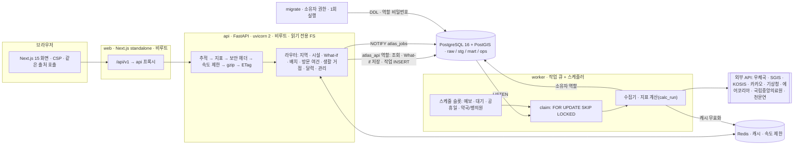

# 시스템 아키텍처

## 흐름

- **조회**: 브라우저는 같은 출처(`/api/v1`)만 부르고 Next 가 api 로 넘깁니다. 공간 연산은 PostGIS, 무거운 응답(GeoJSON·방문 여건)은
  Redis 에 데이터 버전 키로 캐시하고 ETag 로 재검증합니다.
- **쓰기(수집·계산)**: 관리 API·스케줄이 `ops.job` 에 넣으면 워커가 가져가 실행합니다. 수집이 끝나면 재계산 작업이 이어서 들어갑니다.
  계산은 한 트랜잭션에서 스냅샷 → 공간 조인 → 최근접 → 지표 → 생활 거점 → 순위 → 품질 검사 순서로 돌고 `calc_run` 단위로 보존됩니다.
- **권한**: api 는 `atlas_api`(조회·What-if·작업 요청), worker·collector·migrate 는 소유자. raw(원본 응답)는 api 가 읽을 수 없습니다.

## 데이터 계층

| 스키마 | 내용 |
|---|---|
| `raw` | 외부 API 원문(키 마스킹, 1MB 이상 gzip) — 재처리·감사용 |
| `stg` | 수집 스냅샷(우체국) — 이력 병합 전 |
| `mart` | 시설 이력(SCD2), 행정구역·인구·집계구, 계산 결과(지표·최근접·순위), 예보, 약국·병의원, 공휴일, What-if |
| `ops` | 수집 실행, 품질 검사·이슈, 작업 큐 |

자세한 결정은 [ADR 목록](README.md#설계-결정-adr).
